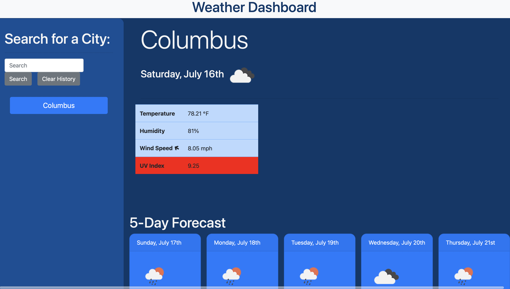
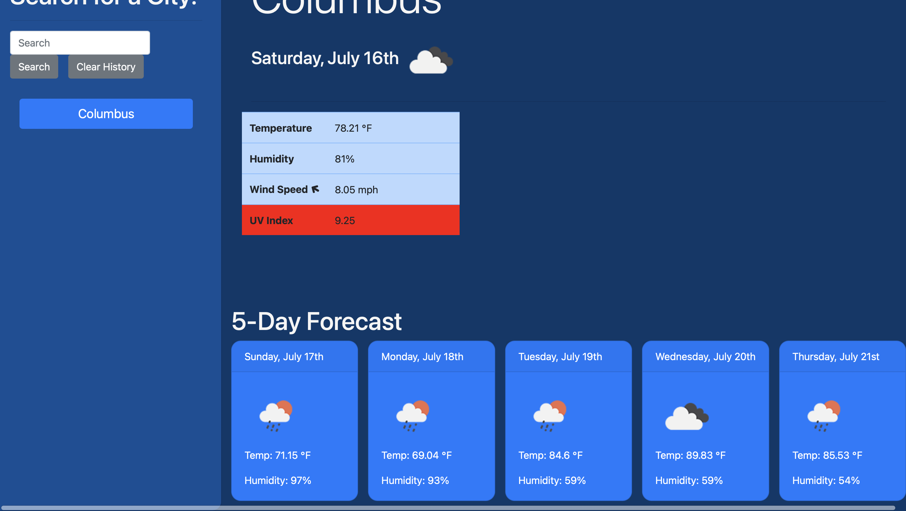

# weather-js-application
## Description
I created a simple weather dashboard app that helps travelers to see the weather outlook for multiple cities so they can plan a trips accordinglythat, The weather app includes a search option, a list of cities, and a five-day forecast. When the user searchs for a city then will be  presented with current and future conditions for that city and that city is added to the search history. When the user views current weather conditions for a city then will be presented with the city name, the date, an icon representation of weather conditions, the temperature, the humidity, the wind speed, and the UV index. When the user views the UV index ,then is  presented with a color that indicates whether the conditions are favorable, moderate, or severe . When the user views future weather conditions for that city, then is presented with a 5-day forecast that displays the date, an icon representation of weather conditions, the temperature, the wind speed, and the humidity . When the user clicks on a city in the search history,then is again presented with current and future conditions for that city.

- Why did you build this project? 
I built this project to give a traveling user an easy and sufficient way to see the weather outlook for multiple cities so then the user is able to plan a trip accordingly, and the user searches for a city's weather, then will be presented with current and future conditions for that city and that city is added to the search history. The weather dashboard app gives easy access, smooth scrolling.

## Usage

The following image shows the web application's appearance and functionality:

## License

License

---
